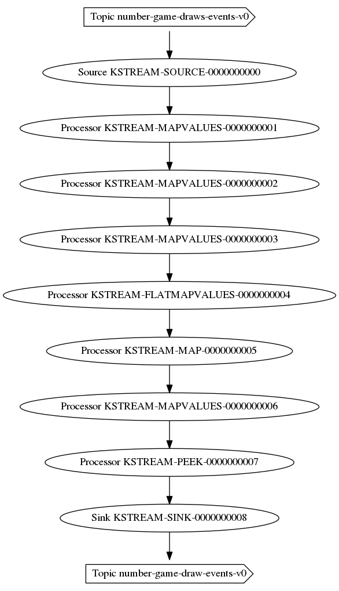

# Kafka Streams API

Kafka Streams is a library that can be used to enable stream processing 
capabilities on your applications.

This means that you can process data "on the fly" (i.e. subscribe to 
events on Kafka) and producer new events. This sounds very similar to
Producer and Consumer API, and it is because those are used inside 
Kafka Streams. But plus consuming and producing events, the capabilities to process
the stream is what makes Streams a powerful API.

## Streams Topology

There are 2 APIs in Kafka Streams: 

* Processor API
* Streams DSL

Where the API define `Processor` stages where data that comes from 
Sources (i.e. Topics) are processed.

But we have a DSL that simplifies the processing of data, and have common 
operators to process data (e.g. mapping, filtering, joining, etc.)

The goal of these APIs is to define a `Topology` that represents 
the Stream Application.

## Streams DSL

Inside Kafka Streams DSL API, there are 2 main abstractions:

* `KStreams`
* `KTable`

`KStreams` represents data in motion and `KTable` represents data at rest.

Both notions are key to implement Streaming Applications.

It provides a functional way to process a Stream (see `RxJava`).

### DSL: Stateless Operations

Stateless operations does not require any internal storage, `map`, `filter` and 
`group` are the most common. 

### DSL: Stateful Operations

Stateful operations includes Joins and Windows of time. Aggregations are also
considered Stateful operations (`count`, `aggregate`, `reduce`)

#### Timestamp Extractor

TODO

### Tables and Joins

TODO

## Windows

TODO